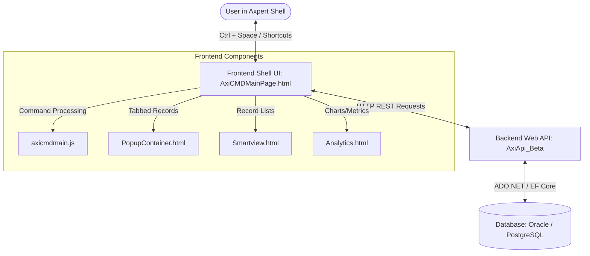

# Axi Command Palette (Axi_Beta) | Technical, Architectural & Usage Documentation

Welcome to the comprehensive documentation for the **Axi Command Palette** plugin (`Axi_Beta`). This document provides system administrators, database administrators, developers, and end-users with a complete guide to the system's architecture, database schema, APIs, frontend layouts, keyboard shortcuts, installation procedures, and daily usage patterns.

---

## 📌 Table of Contents
1. [System Architecture Overview](#-system-architecture-overview)
2. [Database Schema & Objects](#-database-schema--objects)
    * [Tables Catalog](#tables-catalog)
    * [Stored Procedures & Functions (PostgreSQL vs. Oracle)](#stored-procedures--functions-postgresql-vs-oracle)
3. [Backend API Specifications (AxiApi_Beta)](#-backend-api-specifications-axiapi_beta)
4. [Frontend Components & User Interface](#-frontend-components--user-interface)
5. [Interactive Keyboard Shortcuts](#-interactive-keyboard-shortcuts)
6. [Supported Command Catalog](#-supported-command-catalog)
7. [Installation & Deployment Steps](#-installation--deployment-steps)
8. [User Usage Guide](#-user-usage-guide)
    * [Activating the Palette](#activating-the-palette)
    * [Constructing Commands with Auto-Complete Hints](#constructing-commands-with-auto-complete-hints)
    * [Pinning Favourites and Recents](#pinning-favourites-and-recents)
    * [Tabbed Window Management (Popup Container)](#tabbed-window-management-popup-container)
    * [Interactive Lists (Smartview)](#interactive-lists-smartview)
    * [Visual Dashboards (Analytics)](#visual-dashboards-analytics)
9. [Developer/Administrator Configuration Guide](#-developeradministrator-configuration-guide)
    * [Adding Custom Commands](#adding-custom-commands)
    * [Registering Auto-Complete Prompts](#registering-auto-complete-prompts)
    * [Direct SQL Metadata Generation](#direct-sql-metadata-generation)
10. [Troubleshooting & Maintenance](#-troubleshooting--maintenance)

---

## 🏗 System Architecture Overview

The Axi Command Palette is designed as a modular, high-performance command-driven search and navigation utility that integrates directly into the Axpert Web Shell interface. The architecture is split into three main layers:



### 1. Frontend Layer
*   **AxiCMDMainPage.html** ([AxiCMDMainPage.html](file:///D:/Axpert11.4/AxpertWebLatest/AxpertPlugins/Axi_Beta/HTMLPages/AxiCMDMainPage.html)): Integrates directly within Axpert as the master template.
*   **axicmdmain.js** ([axicmdmain.js](file:///D:/Axpert11.4/AxpertWebLatest/AxpertPlugins/Axi_Beta/HTMLPages/js/axicmdmain.js)): Contains the main autocomplete suggestion logic, command parser, state machine, and API client.
*   **Smartview.html** ([Smartview.html](file:///D:/Axpert11.4/AxpertWebLatest/AxpertPlugins/Axi_Beta/HTMLPages/Smartview.html)): Handles interactive record list views, filtering, utility actions, and multi-select deletion.
*   **PopupContainer.html** ([PopupContainer.html](file:///D:/Axpert11.4/AxpertWebLatest/AxpertPlugins/Axi_Beta/HTMLPages/PopupContainer.html)): Provides a tabbed interface to manage multiple open transactions in parallel.
*   **Analytics.html** ([Analytics.html](file:///D:/Axpert11.4/AxpertWebLatest/AxpertPlugins/Axi_Beta/HTMLPages/Analytics.html)): Coordinates dynamic entity analysis, rendering chart panels, custom KPI metrics, and layout scaling.

### 2. Backend API Layer (`AxiApi_Beta`)
*   Built on **.NET 8.0** for high performance and native async request processing.
*   Acts as a microservice running under IIS (or stand-alone).
*   Resolves database connection settings from the shared `appsettings.ini` file in the parent Arm microservices directory.
*   Supports both **PostgreSQL** (`Npgsql`) and **Oracle** (`Oracle.ManagedDataAccess`) data providers.

### 3. Database Layer
*   Maintains configurations for commands and dynamic parameter prompts.
*   Implements security and permission queries to filter search suggestions based on the logged-in user's roles and responsibilities.

---

## 🗄 Database Schema & Objects

The database schema scripts are located under the [Structures](file:///D:/Axpert11.4/AxpertWebLatest/AxpertPlugins/Axi_Beta/Structures/) directory.

### Tables Catalog

The following tables define the command structure and properties:

| Table Name | Description | Key Columns |
| :--- | :--- | :--- |
| `axi_commands` | Stores root command words and their groupings. | `cmdtoken` (PK), `command_group`, `command`, `active` |
| `axi_command_prompts` | Stores prompt inputs, order, dynamic sources, and URL parameters for each token position. | `id` (PK), `cmdtoken`, `wordpos`, `prompt`, `promptsource`, `promptvalues`, `extraparams` |
| `axp_tstructprops` | Manages additional properties for Tstruct definitions (e.g., custom primary key fields). | `name`, `caption`, `keyfield`, `userconfigured` |
| `axdirectsql_metadata` | Caches column names and metadata details for direct SQL queries (`ADS`). | `axdirectsql_metadataid` (PK), `axdirectsqlid`, `fldname`, `fldcaption` |

### Stored Procedures & Functions (PostgreSQL vs. Oracle)

Depending on the database engine, the structures differ slightly to accommodate platform features:
*   **PostgreSQL Scripts:** [Structures/Postgre/Scripts/](file:///D:/Axpert11.4/AxpertWebLatest/AxpertPlugins/Axi_Beta/Structures/Postgre/Scripts/)
*   **Oracle Scripts:** [Structures/Oracle/Scripts/](file:///D:/Axpert11.4/AxpertWebLatest/AxpertPlugins/Axi_Beta/Structures/Oracle/Scripts/)

#### Core Functions:
1.  **`fn_axi_getstructures_meta`**
    *   **PostgreSQL:** [fn_axi_getstructures_meta](file:///D:/Axpert11.4/AxpertWebLatest/AxpertPlugins/Axi_Beta/Structures/Postgre/Scripts/axi_functions.sql#L1079-L1180)
    *   **Oracle:** Returns a pipelined cursor table type `AXI_GETSTRUCTURES_META_tbl`.
    *   **Purpose:** Aggregates all accessible Tstructs, Iviews, Pages, and Axpert Data Sources (ADS) for the logged-in user. Filters by user responsibility permissions.
2.  **`fn_axi_getstructs_obj`**
    *   **PostgreSQL:** [fn_axi_getstructs_obj](file:///D:/Axpert11.4/AxpertWebLatest/AxpertPlugins/Axi_Beta/Structures/Postgre/Scripts/axi_functions.sql#L1351)
    *   **Oracle:** Returns a pipelined type `axi_getstructs_obj_tbl`.
    *   **Purpose:** Fetches records from a target Tstruct base table dynamically based on a search value. Evaluates row-level dimension filters and user read-write permissions.
3.  **`fn_permissions_getpermission`**
    *   **PostgreSQL:** [fn_permissions_getpermission](file:///D:/Axpert11.4/AxpertWebLatest/AxpertPlugins/Axi_Beta/Structures/Postgre/Scripts/axi_functions.sql#L858)
    *   **Purpose:** Validates whether the logged-in user is authorized to perform Create, View, or Edit operations on a specific transaction (transid).
4.  **`fn_axi_getkeyvalueswithfieldnameslist`**
    *   **PostgreSQL:** [fn_axi_getkeyvalueswithfieldnameslist](file:///D:/Axpert11.4/AxpertWebLatest/AxpertPlugins/Axi_Beta/Structures/Postgre/Scripts/axi_functions.sql#L154)
    *   **Purpose:** Dynamically extracts the primary key values and available column descriptors for a given transaction structure.
5.  **`axi_firesql_v2`**
    *   **PostgreSQL:** [axi_firesql_v2](file:///D:/Axpert11.4/AxpertWebLatest/AxpertPlugins/Axi_Beta/Structures/Postgre/Scripts/axi_functions.sql#L614)
    *   **Purpose:** A secure SQL executor that allows parametrized queries to prevent SQL injection vulnerabilities.

> [!NOTE]
> In Oracle environments, SQL procedures return pipelined table sets using custom types like `AXI_GETSTRUCTURES_META` and `axi_getstructs_obj` to achieve maximum compatibility with the .NET Entity Framework Core mapping.

---

## 🔌 Backend API Specifications (AxiApi_Beta)

The .NET 8 backend API acts as the bridge. It provides two key endpoints consumed by the frontend javascript client.

### 1. Retrieve Configured Objects & Permissions
*   **Route:** `/api/v1/Axi/axi_get`
*   **Method:** `POST`
*   **Headers:** `Content-Type: application/json`
*   **Query Parameters / Body:** Passes parameters such as `username`, `roles`, `responsibility`, and `mode`.
*   **Response:** A JSON collection of structs, pages, and direct SQL datasets mapped to the user's workspace profile.

### 2. Manage Favorites / Recents
*   **Route:** `/api/v1/Axi/user-favourites`
*   **Method:** `GET` / `POST` / `DELETE`
*   **Purpose:** Fetches, adds, or deletes commands frequently executed by the user. Caches these actions locally to populate the initial autocomplete list on `Ctrl + Space`.

---

## 🎨 Frontend Components & User Interface

The frontend code leverages existing Axpert UI style libraries and custom CSS extensions:
1.  **AxiCMDMainPage.html** ([AxiCMDMainPage.html](file:///D:/Axpert11.4/AxpertWebLatest/AxpertPlugins/Axi_Beta/HTMLPages/AxiCMDMainPage.html)):
    *   Hosts the search container `<div class="AXI-Sec">` which floats at the top of the interface.
    *   Defines modal overlays for confirming deletion of favorites, custom alerts, and dynamic loading states.
2.  **axicmdmain.js** ([axicmdmain.js](file:///D:/Axpert11.4/AxpertWebLatest/AxpertPlugins/Axi_Beta/HTMLPages/js/axicmdmain.js)):
    *   Maintains autocomplete logic. It tokenizes user inputs and maps them to the matching command group (e.g., `Create`, `Edit`, `View`, `DevTools`).
    *   Appends dynamic parameter helpers in `axiHint` to instruct users on what parameters (like field values or search strings) are expected next.
3.  **axicmdmain.css** ([axicmdmain.css](file:///D:/Axpert11.4/AxpertWebLatest/AxpertPlugins/Axi_Beta/HTMLPages/css/axicmdmain.css)):
    *   Provides clean aesthetics: rounded boundaries, transparent inputs, custom action overlays, and scrollable recommendation list containers.

---

## ⌨️ Interactive Keyboard Shortcuts

Users can operate the command palette entirely via key combinations:

| Keyboard Shortcut | Context / Input Focus | Action Triggered |
| :--- | :--- | :--- |
| **`Ctrl + Space`** | Anywhere in the application | **Toggle Command Palette** (opens or focuses the search input). |
| **`Ctrl + Enter`** | Inside `Axi-Searchinp` | **Run / Execute Command** (triggers navigation, form load, or save). |
| **`Ctrl + S`** | Inside active forms | **Save Record** (automatically commits active structural fields). |
| **`Ctrl + Shift + Enter`** | Selecting suggestions | **Open in Popup** (loads the screen within the tabbed `PopupContainer.html` iframe). |
| **`Ctrl + Alt + Enter`** | Suggestions selected | **View Command Source / Metadata** (opens underlying schema configuration). |
| **`Backspace`** | After command word | **Command Reset** (erases trailing tokens and parameters safely). |

---

## 📋 Supported Command Catalog

Axi evaluates the first word of the user's input to determine the command state.

### 1. `Create [tstruct]`
*   **Description:** Opens a fresh form to create a new transaction record.
*   **Example:** `Create customer`

### 2. `Edit [tstruct] [search value] [object name] with [field name]`
*   **Description:** Navigates directly to an existing transaction record to edit specific fields.
*   **Example:** `Edit customer 10452 John Doe with Email`

### 3. `View [Tstruct/Iview/Page/ADS] [search value] [object name]`
*   **Description:** Displays records in read-only view. Works with transaction forms (`Tstruct`), database views (`Iview`), standard web pages (`Page`), or custom direct SQL configurations (`ADS`).
*   **Example:** `View invoice 2099`

### 4. `Configure [type] [name] [key field]`
*   **Description:** Quick access to system configuration settings. Supported types include `Rule`, `KeyField`, `User`, `Role`, `Responsibility`, `Dimension`, `Form Notification`, and `PEG`.
*   **Example:** `Configure User admin`

### 5. `Upload` & `Download`
*   **Description:** Import or export datasets.

### 6. `DevTools [type] [name]`
*   **Description:** Opens utility tools. Types include `DB Explorer`, `App Variables`, `Arrange Menu`, `Dev Option`, `Language`, and `Custom Plugin`.
*   **Example:** `DevTools DB Explorer`

### 7. `Analyse [entity]` (Deprecated)
*   **Description:** Displays the custom dashboard (`Analytics.html`) showing charts, summary metrics, and KPI graphs for the selected entity. *(Note: This command is deprecated and no longer recommended).*
*   **Example:** `Analyse sales_ledger`

---

## ⚙️ Installation & Deployment Steps

Follow this step-by-step pipeline to host and configure the plugin:

### Step 1: Core Package Deployment
1.  Open the **AxInstaller** tool.
2.  Install the **Axi_Beta** plugin.
3.  Ensure source files populate correctly under `D:\Axpert11.4\AxpertWebLatest\AxpertPlugins\Axi_Beta\`.

### Step 2: Front-End Registration
1.  Copy [AxiCMDMainPage.html](file:///D:/Axpert11.4/AxpertWebLatest/AxpertPlugins/Axi_Beta/HTMLPages/AxiCMDMainPage.html) from `HTMLPages/` directory.
2.  Paste it into the `D:\Axpert11.4\AxpertWebLatest\CustomPages\` folder.
3.  **Warning:** Do not change the filename, as routing relies on `AxiCMDMainPage.html`.

### Step 3: Enable Template inside Axpert Options
1.  Log in to the **AxpertWeb** interface as administrator.
2.  Navigate to **Dev Options** -> **Application Template**.
3.  Choose `AxiCMDMainPage.html` from the dropdown list.
4.  *If missing from the dropdown:* Go to **Configuration Property List** -> edit **Application Template** -> add `AxiCMDMainPage.html` to the Values collection.

### Step 4: IIS Backend Setup (`AxiApi_Beta`)
1.  Copy the [AxiApi_Beta](file:///D:/Axpert11.4/AxpertWebLatest/AxpertPlugins/Axi_Beta/PluginScripts/AxiApi_Beta) folder.
2.  Paste it into the **Arm microservices** publication directory on your target IIS server.
3.  Configure a new Application Pool in IIS Manager:
    *   **Name:** `AxiApi_Beta`
    *   **.NET CLR Version:** `No Managed Code` (since it uses .NET 8 runtime directly).
4.  Create an application pointing to the `AxiApi_Beta` folder.
5.  Copy `appsettings.ini` from `../AxpertWebScript/` and place it in the **Arm microservices** parent directory so the API can read connection strings.
6.  Assign **Read & Write** folder permissions to the App Pool Identity (e.g. `IIS_IUSRS`).

### Step 5: Database Scripts Execution
Execute the appropriate scripts based on your target database:

*   **PostgreSQL:** Run the scripts inside [Structures/Postgre/Scripts/](file:///D:/Axpert11.4/AxpertWebLatest/AxpertPlugins/Axi_Beta/Structures/Postgre/Scripts/):
    1.  `axi_axdirectsql_tables.sql`
    2.  `axi_command_tables.sql`
    3.  `axi_dependent_tables.sql`
    4.  `axi_functions.sql`

*   **Oracle:** Run the scripts inside [Structures/Oracle/Scripts/](file:///D:/Axpert11.4/AxpertWebLatest/AxpertPlugins/Axi_Beta/Structures/Oracle/Scripts/):
    1.  `axi_axdirectsql_tables.sql`
    2.  `axi_command_tables.sql`
    3.  `axi_dependent_tables.sql`
    4.  `axi_functions.sql`

---

## 📖 User Usage Guide

### Activating the Palette & Help Walkthrough
Type **`help`** (case-insensitive) inside the Axi Command pallete search bar. The palette will automatically convert it to `"Help "` and suggest the next token. Select the action or hit **Enter** to launch the interactive onboarding tour.


### Constructing Commands with Auto-Complete Hints
Axi features a **predictive parameter builder** that dynamically shows context hints inside the search bar as you type:

```
Step 1: Type "Create" ──────────> Suggestion lists Tstructs (e.g., "customer")
Step 2: Type "customer" ────────> Input hint shows "[tstruct name]"
Step 3: Press "Ctrl + Enter" ───> Opens Customer Creation form immediately.
```

If editing a record:
1.  Type `Edit`.
2.  Type `customer`.
3.  Type a search value (like a customer ID `10452`). Axi will fetch matching records from the database. Select `John Doe` from the recommendations list.
4.  Type `with`.
5.  Type `Email`. Axi will position the cursor directly onto the Email field of John Doe's customer record for immediate editing.

### Pinning Favourites and Recents
Frequently used commands can be saved for quick execution:
1.  Type any valid command syntax into the input bar and execute it(e.g., `View invoice 2099`).
2.  Click the **Bookmark icon** (`axiFavouriteBtn`) located on the right side of the input.
3.  A popup modal will appear prompting you to name this favorite (e.g., "Check Invoice 2099").
4.  Type the name and press **Enter** (or click **Save**).
5.  Next time you open the Command Palette with `Ctrl + Space`, your saved favorites will populate immediately at the top of the suggestion panel.
6.  **Removing a Favorite:** Hover over the favorite command card in the suggestion list and click the **X icon** (Delete) to remove it from the backend list.

### Tabbed Window Management (Popup Container)
When launching screens from the Command Palette, you can preserve your current shell layout by loading them into a tabbed popup:
1.  Type your command (e.g., `Create customer`).
2.  Press **`Ctrl + Shift + Enter`** (instead of standard `Ctrl + Enter`).
3.  The screen will load in a tab inside the **Popup Container**.
4.  You can open multiple transactions sequentially. Each will open as a separate tab (e.g., "Customer Create", "Invoice 2099", "Sales Chart").
5.  Click on the tabs to switch views instantly. Click the **Close (X) button** on each tab to release the resources.

### Interactive Lists (Smartview)
When searching lists of entities, Axi routes the data into the interactive **Smartview** panel:
*   **Search and Filter:** Use the search bar in the Smartview toolbar to search records, or click the **Tune** icon to open advanced query filters.
*   **Column Customization:** Click the **Services** icon (Utilities) and select **Select Fields**. Check or uncheck columns to customize your data table view.
*   **Batch Action (Delete):** Select multiple records using checkboxes, then click the **Trash/Delete** icon in the toolbar to batch-delete them.


---

## 🛠 Developer/Administrator Configuration Guide

Administrators can customize the commands, parameters, and database bindings.

### Adding Custom Commands
To add a new command group:
1.  Assign a unique `cmdtoken` identifier.
2.  Insert a row into `axi_commands`:
    ```sql
    INSERT INTO axi_commands (cmdtoken, command_group, command, active)
    VALUES (12, 'Publish', '', 'T');
    ```

### Registering Auto-Complete Prompts
To specify what parameter recommendations are shown when the command is typed, insert details into `axi_command_prompts`:
*   `cmdtoken`: Maps to the command group.
*   `wordpos`: The word index location in the typed command where this autocomplete is triggered (1-indexed).
*   `prompt`: Context helper text (e.g., "object name").
*   `promptsource`: The name of the database table, database function, or static list values to load suggestions from.
*   `extraparams`: Parameter mapping bindings (e.g., passing `:username`, `:userrole`, `:transid`).

Example for adding a prompt parameter at position 2:
```sql
INSERT INTO axi_command_prompts (id, cmdtoken, wordpos, prompt, promptsource, extraparams)
VALUES (gen_random_uuid(), 12, 2, 'API Name', 'axi_publishapi', ':username');
```


---

## 🛠 Troubleshooting & Maintenance

*   **Command Palette is not visible:**
    *   Ensure the web application has registered `AxiCMDMainPage.html` as the Application Template in Dev Options.
    *   Check if the console logs show `Axi Input not ready yet... waiting`. If so, ensure that the search input ID (`Axi-Searchinp`) is present in the rendered HTML.
*   **Search suggestions are empty:**
    *   Verify the backend API is running. Open the IIS application URL in your browser (e.g., `http://<server>/AxiApi_Beta/api/v1/Axi/axi_get`) and verify it responds.
    *   Check the API's log file located in `AxiApi_Beta/logs/log.txt` for database connection errors.
    *   Verify that you executed the database scripts (specifically `axi_commands` and `axi_command_prompts`) and the tables are populated.
*   **Data permissions / Row filtering issue:**
    *   Axi evaluates permissions via `fn_permissions_getpermission`. Verify that the user's role responsibilities are correctly assigned in Axpert's standard user settings pages.

---

## 🚀 Release Notes & Recent Bug Fixes (June 19, 2026)

### 1. Interactive Walkthrough Tour & Help Command
*   **Help Trigger Consolidation:** Consolidated help triggers so typing `"help"` (case-insensitive) auto-converts to `"Help "` and displays interactive suggestion tokens instantly.
*   **Aesthetic Tooltip Upgrades:** Styled walkthrough tooltips with high-contrast, rounded purple badges (`#a100ff`) and bright white icons for high visibility.
*   **Z-Index & Reflow Fixes:** Adjusted `intro.js` z-index to `10000000+` to float tooltips cleanly above elevated palette layers.

### 2. Duplicate Metadata Name Resolution (`tstruct` vs `iview`)
*   **Index-Based Dispatching:** Updated element click resolution inside `apply()` to select elements by exact array index in `filteredObjects` rather than name string, preventing type selection conflicts.
*   **Type Resolution Safeguards:** Enhanced `tryResolveToken`, `processParamforEditndView`, and `handleEditData` to reference the active `resolvedParamType`, prioritizing the matching type structure.
*   **Edit Command Type Constraint:** Forced `tryResolveToken` under `Edit` command contexts to resolve structure names as type `"t"` (Tstruct) rather than `"i"` (Iview), enabling edit parameter properties like the `"with"` token to suggest correctly.

### 3. Executable Toolbar Button Scanners (`Run` Command)
*   **Direct Element Targeting:** Refactored toolbar query selectors to select only direct links, buttons, and custom wrappers (`a`, `button`, `input`, and actionable `div[data-kt-menu-trigger]`). This resolves issues where inner buttons (e.g., `"format_list_bulleted"` list view) without explicit `id` parameters were skipped, and restores dropdown trigger options (e.g. `ivirActionButton`).
*   **Hidden Wrapper Exclusions:** Added recursive container checks to filter out hidden buttons or buttons wrapped inside hidden lists (`.d-none`, `.hidden`, `display: none` wrappers) like `"add"`, `"remove"`, and other unused dropdown utility items.
*   **Utility Dropdown Filters:** Screened out generic parent dropdown toggle buttons (such as the wrapper labeled `"Data"`) to display only execution-ready options inside command suggestions.

### 4. Command Catalog Changes
*   **Analyse Command Deprecation:** The `Analyse` command (e.g. `Analyse sales_ledger`) has been **deprecated** and is no longer recommended for active business ledger analysis. Please use standard dashboard or list commands instead.
