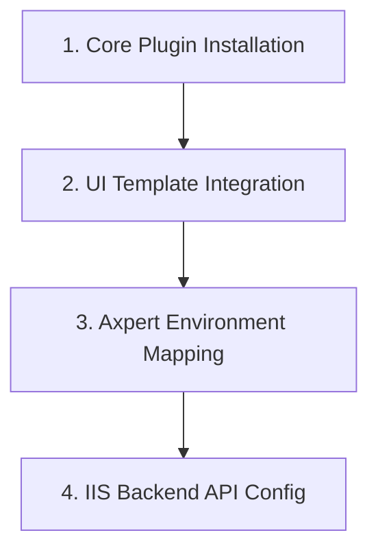

# Axi Command Palette (Postgres & Oracle Support) | Installation & Configuration Guide

This guide walks you through the step-by-step deployment of the **Axi Command Palette** plugin. The deployment bridges the backend API and the Axpert web shell interface.

---

## 🛠 Prerequisites

*   **Server Runtime:** [.NET 8.0 Hosting Bundle](https://dotnet.microsoft.com/download/dotnet/8.0) (Required for hosting the backend API on IIS).
*   **Access Level:** Administrator privileges for IIS Manager and File System modifications.
*   **Tooling:** **AxInstaller** (Latest Version).

---

## 📂 Deployment Steps

### 1. Core Plugin Deployment
1. Launch **AxInstaller**.
2. Select and install the **Axi_Beta** package.
3. **Verification:** Ensure the source files are populated under your `/AxpertPlugins/Axi_Beta/` directory.

---

### 2. UI Template Integration
Register the Axi frontend template within the Axpert ecosystem.

1. **Source:** `../AxpertPlugins/Axi_Beta/HTMLPages/js/axicmdmain.js` and `AxiCMDMainPage.html`
2. **Destination:** Copy `AxiCMDMainPage.html` to `../CustomPages/`
3. **Note:** Do not rename the file; Axpert's system routing relies on the exact filename `AxiCMDMainPage.html`.

---

### 3. Axpert Environment Mapping
Configure your Axpert web application to use the newly integrated template.

1. Log in to **AxpertWeb** -> Navigate to **Dev Options**.
2. Locate **Application Template** and select `AxiCMDMainPage.html` from the Property value dropdown.
3. **Manual Override (If the file does not appear in the dropdown):**
    * Navigate to **Configuration Property List**.
    * Edit the **Application Template** property.
    * Manually append `AxiCMDMainPage.html` to the **Values** collection.

---

### 4. IIS Backend Configuration (AxiApi_Beta)
Host the API service as a high-performance .NET 8 application.

1. **API Folder Placement:**
    * Copy the `AxiApi_Beta` folder from `../AxpertPlugins/Axi_Beta/PluginScripts/AxiApi_Beta`.
    * Paste it into the destination **Arm microservices** folder on the target server.
2. **Application Pool Setup:**
    * Name: `AxiApi_Beta`
    * .NET CLR Version: **No Managed Code**
3. **Site/Application Creation:** Create a new application in IIS pointing to the copied `AxiApi_Beta` folder inside the **Arm microservices** directory.
4. **Dependency Injection:**
    * Copy `appsettings.ini` from your `../AxpertWebScript/` folder.
    * Paste it into your **Arm microservices** directory.
5. **Permissions:** Ensure the App Pool Identity (e.g., `IIS_IUSRS` or the custom application pool identity) has **Read & Write** permissions over the publish folder.
