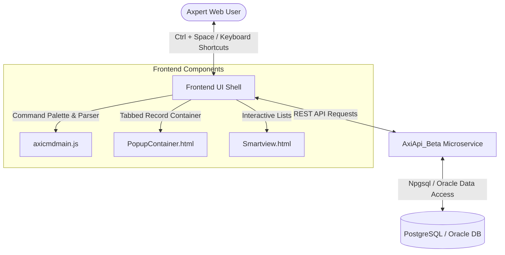
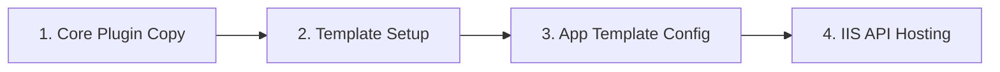

# Axi Command Palette (`Axi_Beta`)

The **Axi Command Palette** (`Axi_Beta`) is an in-app command palette and search navigation utility designed for the Axpert Web Shell interface. It provides real-time autocomplete, multi-entity structure execution (Tstructs, Iviews, Axpert Data Sources / ADS, Pages, and Inbox), tabbed window management, and interactive record filtering.

---

## Architecture Overview

Axi operates across a three-tier architecture that integrates into the Axpert shell:

```mermaid
graph TD
    User([Axpert Web User]) <-->|Ctrl + Space / Keyboard Shortcuts| Frontend[Frontend UI Shell]
    Frontend <-->|REST API Requests| Backend[AxiApi_Beta Microservice]
    Backend <-->|Npgsql / Oracle Data Access| DB[(PostgreSQL / Oracle DB)]

    subgraph Frontend Components
        Frontend -->|Command Palette & Parser| Main[axicmdmain.js]
        Frontend -->|Tabbed Record Container| Popup[PopupContainer.html]
        Frontend -->|Interactive Lists| Smart[Smartview.html]
    end
```

### 1. Frontend Layer
* **`AxiCMDMainPage.html`**: Host template loaded by Axpert as the application shell interface.
* **`axicmdmain.js`**: Core engine handling input parsing, token resolution, state tracking (`resolvedParams`, `resolvedParamType`), suggestions ranking, and route dispatching.
* **`Smartview.html`**: Interactive list view container supporting dynamic filters, column groupings, and bulk record operations.
* **`PopupContainer.html`**: Tabbed layout engine allowing users to execute and view multiple transaction records concurrently.

### 2. Backend API (`AxiApi_Beta`)
* Built on **.NET 8.0** with asynchronous request handlers.
* Hosted as an IIS Application inside the ARM microservices environment.
* Supports **PostgreSQL** (`Npgsql`) and **Oracle** (`Oracle.ManagedDataAccess`) database providers using configuration parameters loaded from `appsettings.ini`.

### 3. Database Layer
* Manages command catalog configurations, prompt sequences, and user permission mappings across Tstructs, Iviews, ADS, and Pages.
* Located under [`Structures/`](file:///D:/Axpert11.4/AxpertWebLatest/AxpertPlugins/Axi_Beta/Structures/).

---

## Core Capabilities

* **Structure Disambiguation:** Resolves entities sharing identical names across Tstructs (`t`), Iviews (`i`), ADS (`ads`/`a`/`v`), Pages (`p`), and Inbox structures using type badges (`[form]`, `[iview]`, `[ads]`) and context-aware default rules.
* **Flexible Syntax Normalization:** Supports both `<Action> <TargetEntity>` (e.g. `View Customer`) and `<TargetEntity> <Action>` (e.g. `Customer View`) with state preservation.
* **Role-Based Permission Filtering:** Restricts search suggestions and command execution dynamically based on logged-in user responsibilities (`fn_permissions_getpermission`).
* **Session & State Management:** Preserves resolved parameter states across token edits while resetting state on clear button clicks, empty inputs, and system refresh.

---

## Database Objects Catalog

The database setup scripts are organized by provider under [`Structures/Postgre/Scripts/`](file:///D:/Axpert11.4/AxpertWebLatest/AxpertPlugins/Axi_Beta/Structures/Postgre/Scripts/) and [`Structures/Oracle/Scripts/`](file:///D:/Axpert11.4/AxpertWebLatest/AxpertPlugins/Axi_Beta/Structures/Oracle/Scripts/).

### Core Tables

| Table | Purpose |
| :--- | :--- |
| `axi_commands` | Stores root command verbs, aliases, and active statuses. |
| `axi_command_prompts` | Defines dynamic auto-complete prompt fields, positional order, and data sources. |
| `axp_tstructprops` | Maintains additional properties for Tstruct definitions (e.g. primary key field configurations). |
| `axdirectsql_metadata` | Caches metadata and field captions for Direct SQL / ADS queries. |

### Core Stored Procedures & Functions

* **`fn_axi_getstructures_meta`**: Returns metadata for all Tstructs, Iviews, Pages, and ADS structures accessible to the current user.
* **`fn_axi_getstructs_obj`**: Dynamically queries records from a target structure with permission and row-level dimension filtering.
* **`fn_permissions_getpermission`**: Validates user access rights (`Create`, `View`, `Edit`) for transaction IDs (`transid`).

---

## Deployment & Setup

```mermaid
graph LR
    Step1[1. Core Plugin Copy] --> Step2[2. Template Setup]
    Step2 --> Step3[3. App Template Config]
    Step3 --> Step4[4. IIS API Hosting]
```

### 1. Core Files Placement
1. Install or copy the `Axi_Beta` plugin folder into `/AxpertPlugins/Axi_Beta/`.
2. Copy `AxiCMDMainPage.html` from `AxpertPlugins/Axi_Beta/HTMLPages/` into `../CustomPages/AxiCMDMainPage.html`.

> [!IMPORTANT]
> Do not rename `AxiCMDMainPage.html`. The Axpert routing system relies on this exact filename.

### 2. Axpert Environment Configuration
1. Log in to **AxpertWeb** $\rightarrow$ Navigate to **Dev Options**.
2. Set **Application Template** property to `AxiCMDMainPage.html`.
3. If `AxiCMDMainPage.html` is not visible in the dropdown, navigate to **Configuration Property List**, edit **Application Template**, and append `AxiCMDMainPage.html` to the Values collection.

### 3. IIS Backend API (`AxiApi_Beta`) Hosting
1. Copy `AxiApi_Beta` from `AxpertPlugins/Axi_Beta/PluginScripts/AxiApi_Beta` into your target **Arm microservices** folder.
2. In IIS Manager, create an Application Pool named `AxiApi_Beta` set to **No Managed Code**.
3. Create a new IIS Application pointing to the `AxiApi_Beta` directory.
4. Ensure `appsettings.ini` is present in the parent microservices folder to supply database connection credentials.
5. Grant **Read & Write** file permissions to the IIS Application Pool identity (`IIS_IUSRS`).

---

## Key Files Reference

* [`HTMLPages/js/axicmdmain.js`](file:///D:/Axpert11.4/AxpertWebLatest/AxpertPlugins/Axi_Beta/HTMLPages/js/axicmdmain.js): Command palette core JavaScript engine.
* [`HTMLPages/AxiCMDMainPage.html`](file:///D:/Axpert11.4/AxpertWebLatest/CustomPages/AxiCMDMainPage.html): Main application template.
* [`HTMLPages/Smartview.html`](file:///D:/Axpert11.4/AxpertWebLatest/AxpertPlugins/Axi_Beta/HTMLPages/Smartview.html): Dynamic list view engine for ADS and Iviews.
* [`HTMLPages/PopupContainer.html`](file:///D:/Axpert11.4/AxpertWebLatest/AxpertPlugins/Axi_Beta/HTMLPages/PopupContainer.html): Multi-tab popup window manager.
* [`DOCUMENTATION.md`](file:///D:/Axpert11.4/AxpertWebLatest/AxpertPlugins/Axi_Beta/DOCUMENTATION.md): Detailed technical & developer guide.
